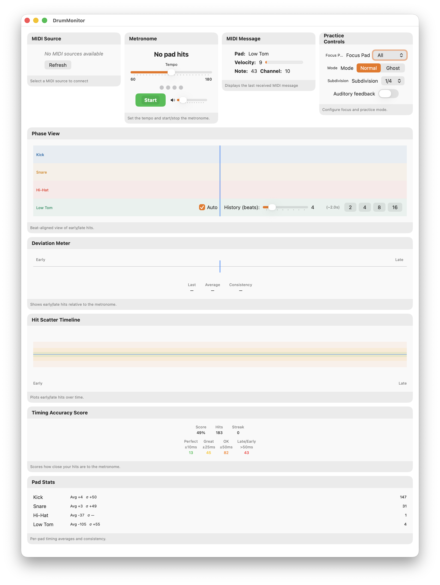

# DrumMonitor

DrumMonitor is a macOS SwiftUI app for MIDI drum timing practice. It listens to a connected MIDI drum source and compares every hit against an internal metronome in real time, turning raw MIDI timing into visual feedback, scoring, and per-pad statistics so you can see — beat by beat — how close your playing is to the click.



## Features

- MIDI source selection and connect/disconnect
- Internal metronome with:
  - tempo control (`60...180 BPM`)
  - subdivision support (`1/4`, `1/8`, `1/16`)
  - ghost mode (`N` bars on / `N` bars off)
  - beat indicator synchronized to subdivision ticks
- BPM estimate from incoming pad hits when metronome is stopped
- Timing feedback views:
  - `Phase View` (beat-aligned early/late hit display per pad)
  - `Deviation Meter` (instant early/late placement with rolling stats)
  - `Hit Scatter Timeline` (deviation over time)
  - `Timing Accuracy Score` (bucketed scoring + streak)
  - `Pad Stats` (per-pad average and consistency)
- Optional auditory feedback for hits outside a deviation threshold
- Persistent UI settings:
  - window size and position
  - phase view history mode/settings
  - metronome BPM and volume

## Requirements

- macOS 14.0 Sonoma or later
- Apple Silicon only
- Xcode with SwiftUI and CoreMIDI support
- A MIDI drum source (hardware or virtual)

## Installation

### Build from source

1. Clone the repository:
   ```bash
   git clone https://github.com/dirkclemens/DrumMonitor.git
   cd DrumMonitor
   ```
2. Open the project:
   ```bash
   open DrumMonitor.xcodeproj
   ```
3. Select the `DrumMonitor` scheme and run on macOS.

### Prebuilt DMG

A ready-to-run build is available as `DrumMonitor-1.0.dmg` (ad-hoc signed, Apple Silicon only). Since it isn't notarized by Apple, macOS blocks it on first launch. Remove the quarantine flag before opening:

```bash
xattr -dr com.apple.quarantine /Applications/DrumMonitor.app
```

Alternatively, right-click the app in Finder and choose "Open".

---

## Usage

1. In `MIDI Source`, connect to your drum controller.
2. Start the metronome and set tempo/subdivision.
3. Use `Practice Controls` to choose:
   - focus pad (or all pads)
   - normal vs ghost mode
   - auditory feedback threshold
4. Watch timing quality across:
   - `Phase View` for immediate early/late alignment
   - `Deviation Meter` for recent timing spread
   - `Hit Scatter Timeline` for drift and trends
   - `Timing Accuracy Score` for measurable progress

## Project Structure

- `DrumMonitor/DrumMonitorApp.swift`: app entry point
- `DrumMonitor/MIDIManager.swift`: MIDI client, source management, message publish/notifications, shared practice settings
- `DrumMonitor/ContentView.swift`: main layout + window size/position persistence
- `DrumMonitor/MetronomeView.swift`: metronome audio, subdivisions, ghost mode, hit BPM, auditory feedback
- `DrumMonitor/OscilloscopeView.swift`: beat-aligned phase view
- `DrumMonitor/DeviationMeterView.swift`: deviation meter
- `DrumMonitor/HitScatterTimelineView.swift`: scatter timeline
- `DrumMonitor/TimingAccuracyScoreView.swift`: score + streak
- `DrumMonitor/PadStatsView.swift`: per-pad stats
- `DrumMonitor/PracticeControlView.swift`: training mode controls

## Notes

- Timing visuals use incoming MIDI Note On events with velocity `> 0`.
- Most views rely on metronome tick notifications for alignment; start the metronome for best results.
- Some experimental/legacy views still exist in the codebase but are not currently part of the main screen.

---

## License

This project is licensed under the [PolyForm Noncommercial License 1.0.0](https://polyformproject.org/licenses/noncommercial/1.0.0) — see [LICENSE](LICENSE) for details. Free for noncommercial use; commercial use requires a separate license from the author.
